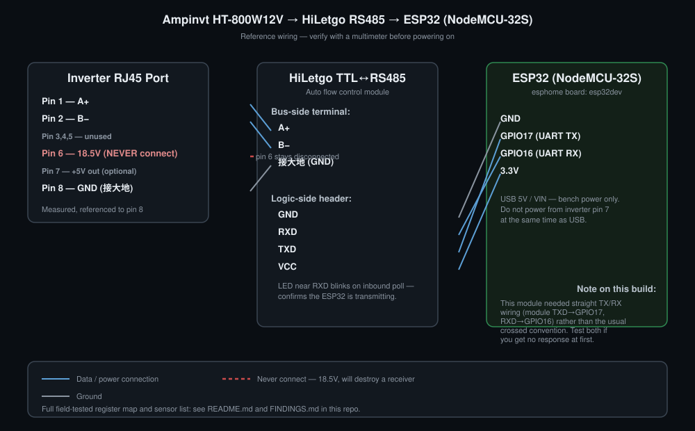

# AMPINVT HT-800W12V → ESPHome → Home Assistant

Monitor an **[AMPINVT HT-800W12V UPS/inverter-charger](https://www.amazon.com/dp/B098QL2VBZ)** over its RS485 Modbus
port using an ESP32 running [ESPHome](https://esphome.io), reporting directly
into [Home Assistant](https://www.home-assistant.io) via ESPHome's native API
(no MQTT broker required).

This started as a fork of the excellent groundwork in
[Bgilsing/ampinvt-ht12212-modbus](https://github.com/Bgilsing/ampinvt-ht12212-modbus),
which reverse-engineered the Modbus RTU protocol on the **HT-1200W12V
(HT-12212)**. This repo documents what changes — and what doesn't work — on
the smaller **HT-800W12V** unit, plus a full ESPHome build instead of a
Raspberry Pi + Modbus TCP gateway.

If you own any Ampinvt HT/HTS/FT/TG-series inverter, testing this against
your unit and reporting back (here or upstream) helps map the whole product
line. See [FINDINGS.md](FINDINGS.md) for the full register sweep this repo
is based on, and the "Verified on" table below.

---

## How it fits together

```
AMPINVT HT-800W12V  --RS485 (RJ45, pins 1/2/8)-->  HiLetgo TTL-RS485 module
                                                            |
                                                     UART (GPIO16/17)
                                                            |
                                                          ESP32
                                                     (ESPHome firmware)
                                                            |
                                                      WiFi, native API
                                                            |
                                                     Home Assistant
```

- **ESPHome** owns the RS485/Modbus polling, does the scaling math, and
  exposes each field as a Home Assistant sensor entity automatically —
  no YAML on the Home Assistant side, no MQTT broker, no separate gateway
  process. The ESP32 polls the inverter every 5 seconds and pushes updates
  over its encrypted native API connection.
- **Home Assistant** just needs the built-in ESPHome integration, which
  auto-discovers the device via mDNS once it's on your network.

## Hardware used

| Part | Specific hardware |
|---|---|
| UPS / inverter-charger | [AMPINVT HT-800W12V](https://www.amazon.com/dp/B098QL2VBZ) (800W, 12V DC / 120V AC), RS485 on RJ45 |
| Microcontroller | ESP32 dev board, silkscreened "NodeMCU-32S" (ESP32-WROOM-32 module) |
| RS485 transceiver | [HiLetgo TTL to RS485 UART module](https://www.amazon.com/dp/B082Y19KV9), automatic flow control (auto direction, no DE/RE pin needed) |

See [`docs/wiring-diagram.svg`](docs/wiring-diagram.svg) for the full pinout
reference. Real photos of the physical build are welcome as a follow-up PR —
none are included here to avoid using vendor/marketplace product photography.

### Wiring summary

| From | To |
|---|---|
| RJ45 pin 1 (A+) | RS485 module A+ |
| RJ45 pin 2 (B−) | RS485 module B− |
| RJ45 pin 8 (GND / 接大地) | RS485 module GND |
| RJ45 pin 6 | **Do not connect.** Carries ~18.5V on this unit — will destroy a transceiver. |
| RS485 module VCC | ESP32 3.3V |
| RS485 module GND | ESP32 GND |
| RS485 module TXD | ESP32 GPIO17 |
| RS485 module RXD | ESP32 GPIO16 |

This particular auto-flow RS485 module needed **straight, non-crossed**
TX/RX wiring to work reliably — the opposite of the usual UART crossover
convention. If you wire the conventional way and get complete silence
(Modbus timeouts, device shows offline), try swapping GPIO16/17 before
assuming anything else is wrong.

Link parameters: **9600 baud, 8N1, slave address 1**, Modbus RTU, matching
the upstream repo's findings — this part is identical across the HT-1200W12V
and HT-800W12V.

## Sensors and registers (confirmed working on the HT-800W12V)

All via function `0x04` (read input registers), read-only:

| Register | Field | Raw scale | Unit | Notes |
|---|---|---|---|---|
| 0 | AC Input Voltage | ÷10 | V | |
| 1 | AC Input Frequency | ÷10 | Hz | |
| 2 | AC Output Voltage | ÷10 | V | |
| 3 | AC Output Frequency | ÷10 | Hz | |
| 6 | Charge Current | ÷10 | A | May actually be general battery current (charge/discharge), not charge-only OR even the indicator in A of load — unconfirmed sign behavior, I'll likely test later |
| 7 | Battery Voltage | ÷10 | V | |
| 9 | Battery Capacity | ×1 | % | Voltage-curve estimate, not a true coulomb-counted SoC — expect it to swing with load |
| 32 | Status Word (raw) | — | — | Bit meanings undecoded. Reads `0x0103` (259) with AC present + charging, matching the reference HT-12212 unit exactly |

## What doesn't work on the HT-800W12V

Unlike the HT-1200W12V this protocol was originally reverse-engineered
against, the **HT-800W12V does not expose Load %, Output Power, or
Temperature** over Modbus — on either input or holding registers, across an
exhaustive sweep. See [FINDINGS.md](FINDINGS.md) for the full methodology,
including cross-checking against a real ~200W load measured independently
with a smart plug.

If you need real power draw from an HT-800W12V setup, use an external smart
plug upstream of the unit — the inverter itself won't report it.

## Verified on

| Model | Internal model | Wattage | Verified by | Load% / Power / Temp | Notes |
|---|---|---|---|---|---|
| HT-1200W12V | HT-12212 | 1200W | [Bgilsing](https://github.com/Bgilsing/ampinvt-ht12212-modbus) | Working | Original protocol reverse-engineering |
| HT-800W12V | — | 800W | this repo | **Not implemented** | AC V/Hz, charge current, battery V/%, status word all confirmed working |

If you test this against another model in the line, please open an issue or
PR with your findings — a register-by-register confirmation table like the
one above is exactly what makes this useful across the product line.

## Setup

1. Wire everything per the table below: .
2. Copy `config/secrets.yaml.example` to `config/secrets.yaml` and fill in
   your WiFi credentials. (Or let the ESPHome dashboard generate an API key
   for you when you add the device — either works.)
3. Add `config/ampinvt-ups.yaml` as a new device in your ESPHome dashboard,
   or compile/flash it directly with the ESPHome CLI.
4. First flash requires USB; every flash after that can go over WiFi (OTA).
5. Add the device in Home Assistant via Settings → Devices & Services → it
   should auto-discover via mDNS as `ampinvt-ups.local`.

## Credits

- [Bgilsing/ampinvt-ht12212-modbus](https://github.com/Bgilsing/ampinvt-ht12212-modbus) —
  the original Modbus RTU reverse-engineering this repo builds on, including
  ruling out Ampinvt's separate APC charge-controller protocol and finding
  the RJ45 pin 6 danger voltage.
- Not affiliated with or endorsed by Ampinvt / Foshan Top One Power
  Technology.

## License

MIT — see [LICENSE](LICENSE).
